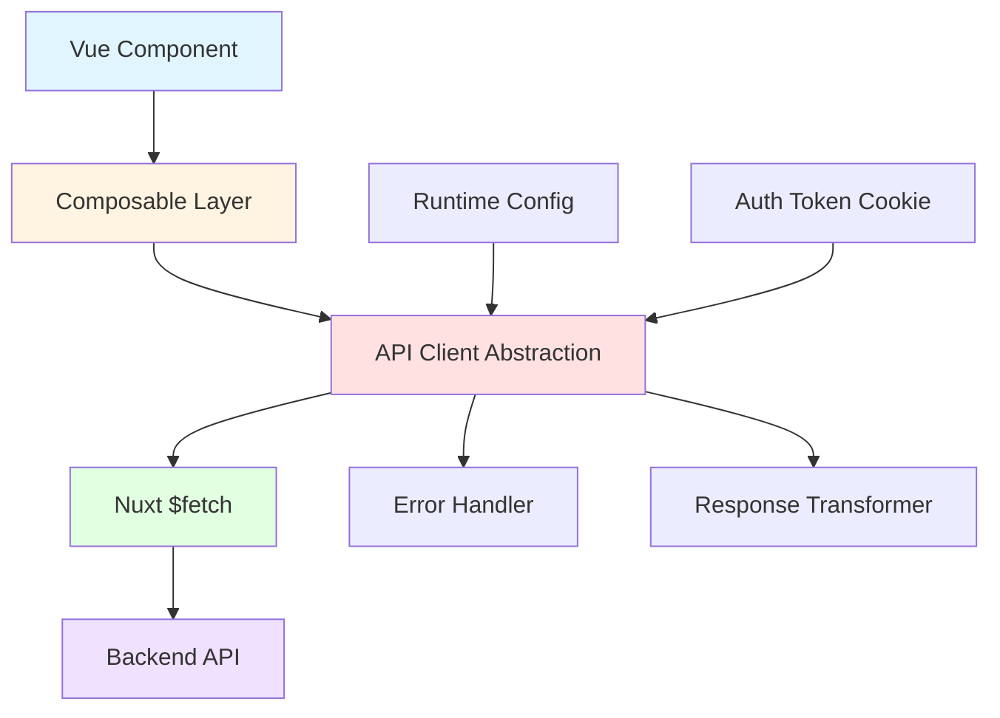
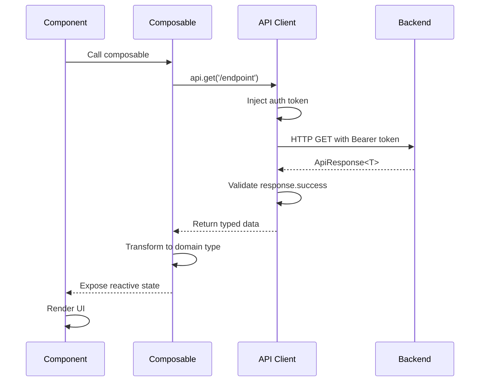
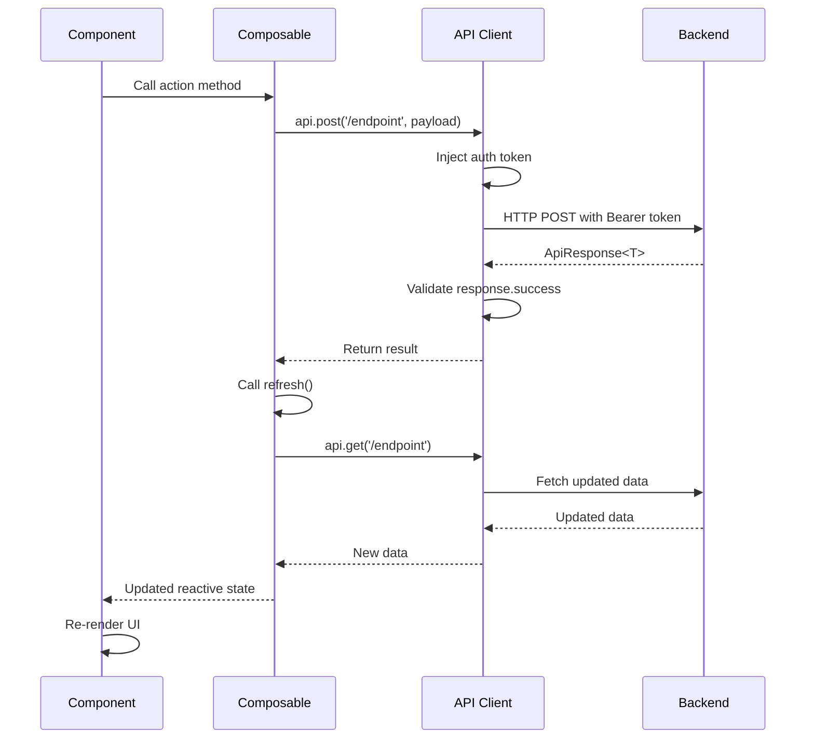
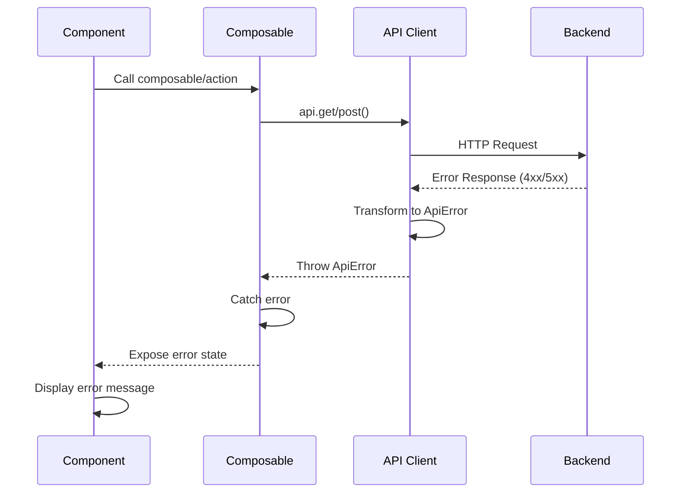

# Design Document: Talent Dashboard Backend Integration

## Overview

This design document outlines the architecture and implementation strategy for replacing mock data (`useMockResource`) with real API calls in the CariTalent talent dashboard. The integration covers seven composables that manage profile, applications, bookings, invitations, events, reviews, and profile settings.

The design focuses on creating a reusable API client abstraction layer that handles authentication, error handling, and response transformation consistently across all composables. This ensures maintainability, testability, and a consistent developer experience.

**Key Design Goals:**
- **Separation of Concerns**: API client logic separated from business logic in composables
- **Type Safety**: Full TypeScript support with proper type inference
- **Error Handling**: Consistent error handling with user-friendly messages
- **Authentication**: Automatic Bearer token injection for authenticated requests
- **Reusability**: Shared utilities for common API patterns (GET, POST, PUT, DELETE)
- **Testability**: Easy to mock and test individual layers

---

## Architecture

### High-Level Architecture



### Layer Responsibilities

#### 1. **Vue Component Layer**
- Renders UI based on composable state
- Handles user interactions
- Displays loading states and errors
- Triggers data refresh when needed

#### 2. **Composable Layer** (`app/composables/`)
- Encapsulates business logic for specific domains (profile, applications, etc.)
- Uses `useAsyncData` or `useLazyAsyncData` for data fetching
- Exposes reactive state: `data`, `pending`, `error`, `refresh`
- Transforms API responses into domain-specific types
- Provides action methods (e.g., `respondToInvitation`, `updateProfile`)

#### 3. **API Client Abstraction Layer** (`app/utils/api-client.ts`)
- Centralized HTTP client configuration
- Automatic Bearer token injection
- Base URL configuration from runtime config
- Request/response interceptors
- Error transformation and handling
- Type-safe request methods

#### 4. **Nuxt $fetch Layer**
- Native Nuxt HTTP client
- SSR-compatible
- Automatic request deduplication
- Built-in error handling

---

## Components and Interfaces

### API Client Abstraction

The API client provides a type-safe wrapper around Nuxt's `$fetch` with automatic authentication and error handling.

**File**: `app/utils/api-client.ts`

```typescript
import type { ApiResponse } from '~/composables/types'

export class ApiError extends Error {
  constructor(
    message: string,
    public statusCode: number,
    public data?: any
  ) {
    super(message)
    this.name = 'ApiError'
  }
}

export interface ApiClientOptions {
  method?: 'GET' | 'POST' | 'PUT' | 'DELETE'
  body?: any
  query?: Record<string, any>
  headers?: Record<string, string>
  requiresAuth?: boolean
}

export const createApiClient = () => {
  const config = useRuntimeConfig()
  const baseURL = config.public.apiBase as string
  const token = useCookie<string | null>('auth_token')

  const request = async <T>(
    endpoint: string,
    options: ApiClientOptions = {}
  ): Promise<ApiResponse<T>> => {
    const {
      method = 'GET',
      body,
      query,
      headers = {},
      requiresAuth = true,
    } = options

    // Check authentication
    if (requiresAuth && !token.value) {
      throw new ApiError('Authentication required', 401)
    }

    // Build headers
    const requestHeaders: Record<string, string> = {
      'Content-Type': 'application/json',
      ...headers,
    }

    if (requiresAuth && token.value) {
      requestHeaders.Authorization = `Bearer ${token.value}`
    }

    try {
      const response = await $fetch<ApiResponse<T>>(endpoint, {
        baseURL,
        method,
        headers: requestHeaders,
        body,
        query,
      })

      // Check if response indicates failure
      if (!response.success) {
        throw new ApiError(
          response.message || 'Request failed',
          400,
          response
        )
      }

      return response
    } catch (error: any) {
      // Handle $fetch errors
      if (error.statusCode === 401) {
        // Clear token and redirect to login
        token.value = null
        await navigateTo('/login')
        throw new ApiError('Session expired', 401)
      }

      if (error.statusCode === 403) {
        throw new ApiError('Access denied', 403)
      }

      if (error.statusCode === 404) {
        throw new ApiError('Resource not found', 404)
      }

      if (error.statusCode === 422) {
        throw new ApiError(
          error.data?.message || 'Validation failed',
          422,
          error.data?.errors
        )
      }

      if (error.statusCode >= 500) {
        throw new ApiError('Server error. Please try again later.', 500)
      }

      // Network or unknown errors
      throw new ApiError(
        error.message || 'Network error. Please check your connection.',
        0
      )
    }
  }

  return {
    get: <T>(endpoint: string, query?: Record<string, any>, requiresAuth = true) =>
      request<T>(endpoint, { method: 'GET', query, requiresAuth }),

    post: <T>(endpoint: string, body?: any, requiresAuth = true) =>
      request<T>(endpoint, { method: 'POST', body, requiresAuth }),

    put: <T>(endpoint: string, body?: any, requiresAuth = true) =>
      request<T>(endpoint, { method: 'PUT', body, requiresAuth }),

    delete: <T>(endpoint: string, requiresAuth = true) =>
      request<T>(endpoint, { method: 'DELETE', requiresAuth }),
  }
}

// Composable wrapper for API client
export const useApiClient = () => createApiClient()
```

### Composable Pattern

Each composable follows a consistent pattern:

```typescript
export const useComposableName = (params?: any) => {
  const api = useApiClient()

  // Fetch data using useAsyncData
  const {
    data: response,
    pending,
    error,
    refresh,
  } = useAsyncData(
    'unique-key',
    async () => {
      const result = await api.get<DataType>('/endpoint', params)
      return result
    },
    {
      // Options
      lazy: false,
      server: true,
      default: () => ({ success: false, message: '', data: null }),
    }
  )

  // Transform data
  const data = computed(() => response.value?.data ?? defaultValue)

  // Action methods
  const actionMethod = async (payload: any) => {
    try {
      const result = await api.post('/endpoint', payload)
      await refresh() // Refresh data after mutation
      return result
    } catch (error) {
      throw error
    }
  }

  return {
    data,
    pending,
    error,
    refresh,
    actionMethod,
  }
}
```

---

## Data Models

### Core Types (Already Defined in `types.ts`)

The existing type definitions in `app/composables/types.ts` are comprehensive and will be reused:

- `ApiResponse<T>`: Standard API response envelope
- `TalentProfile`: Combined user + talent profile data
- `Application`: Talent application to events
- `Booking`: Confirmed bookings
- `Invitation`: Event organizer invitations
- `Event`: Event listings
- `TalentReviewItem`: Review data
- `PaginationMeta`: Pagination information

### Additional Types for API Client

```typescript
// app/composables/types.ts (additions)

export type ApiErrorResponse = {
  success: false
  message: string
  errors?: Record<string, string[]>
}

export type UpdateProfilePayload = {
  name: string
  phone: string
}

export type ChangePasswordPayload = {
  current_password: string
  new_password: string
  new_password_confirmation: string
}

export type RespondToInvitationPayload = {
  status: 'accepted' | 'rejected'
}

export type UploadMediaPayload = {
  file: File
  type: TalentMediaType
}
```

---

## Data Flow

### Read Flow (GET Requests)



### Write Flow (POST/PUT Requests)



### Error Flow



---

## Error Handling

### Error Handling Strategy

**Principles:**
1. **User-Friendly Messages**: Transform technical errors into readable messages
2. **Consistent Format**: All errors follow the same structure
3. **Actionable Feedback**: Provide guidance on what users can do
4. **Graceful Degradation**: Handle errors without breaking the UI

### Error Types and Handling

| HTTP Status | Error Type | Handling Strategy |
|-------------|------------|-------------------|
| 401 | Unauthorized | Clear token, redirect to login |
| 403 | Forbidden | Show "Access denied" message |
| 404 | Not Found | Show "Data not found" message |
| 422 | Validation Error | Display field-specific errors |
| 500 | Server Error | Show generic error + retry button |
| Network | Connection Error | Show "Check your connection" |

### Error Display Pattern

```typescript
// In component
const { data, pending, error } = useProfile()

// Template
<template>
  <div v-if="pending">Loading...</div>
  <div v-else-if="error">
    <UAlert
      color="red"
      variant="soft"
      :title="error.message"
      :description="getErrorDescription(error)"
    />
    <UButton @click="refresh">Try Again</UButton>
  </div>
  <div v-else>
    <!-- Render data -->
  </div>
</template>
```

### Validation Error Handling

For 422 errors with field-specific validation:

```typescript
const handleSubmit = async () => {
  try {
    await updateProfile(formData)
    toast.add({ title: 'Profile updated successfully' })
  } catch (error: any) {
    if (error.statusCode === 422 && error.data) {
      // Display field errors
      Object.entries(error.data).forEach(([field, messages]) => {
        toast.add({
          title: `${field}: ${messages[0]}`,
          color: 'red'
        })
      })
    } else {
      toast.add({
        title: error.message,
        color: 'red'
      })
    }
  }
}
```

---

## Environment Configuration

### Runtime Config Setup

**File**: `nuxt.config.ts`

```typescript
export default defineNuxtConfig({
  runtimeConfig: {
    // Private keys (server-side only)
    // None needed for this feature

    // Public keys (exposed to client)
    public: {
      apiBase: process.env.NUXT_PUBLIC_API_BASE || 'https://api.caritalent.id/api/v1'
    }
  }
})
```

### Environment Variables

**File**: `.env`

```bash
# API Configuration
NUXT_PUBLIC_API_BASE=https://api.caritalent.id/api/v1

# Development
# NUXT_PUBLIC_API_BASE=http://localhost:8000/api/v1

# Staging
# NUXT_PUBLIC_API_BASE=https://staging-api.caritalent.id/api/v1
```

### Usage in Code

```typescript
// Access runtime config
const config = useRuntimeConfig()
const baseURL = config.public.apiBase

// Used automatically by API client
const api = useApiClient()
```

---

## Testing Strategy

### Unit Testing

**Test Composables in Isolation:**

```typescript
// tests/composables/useProfile.test.ts
import { describe, it, expect, vi } from 'vitest'
import { useProfile } from '~/composables/useProfile'

describe('useProfile', () => {
  it('should fetch profile data successfully', async () => {
    // Mock API client
    vi.mock('~/utils/api-client', () => ({
      useApiClient: () => ({
        get: vi.fn().mockResolvedValue({
          success: true,
          data: { /* mock data */ }
        })
      })
    }))

    const { data, pending } = useProfile()
    
    await nextTick()
    
    expect(pending.value).toBe(false)
    expect(data.value).toBeDefined()
  })

  it('should handle errors gracefully', async () => {
    // Mock API error
    vi.mock('~/utils/api-client', () => ({
      useApiClient: () => ({
        get: vi.fn().mockRejectedValue(new ApiError('Failed', 500))
      })
    }))

    const { error } = useProfile()
    
    await nextTick()
    
    expect(error.value).toBeDefined()
  })
})
```

### Integration Testing

**Test API Client with Mock Backend:**

```typescript
// tests/utils/api-client.test.ts
import { describe, it, expect, beforeEach } from 'vitest'
import { createApiClient } from '~/utils/api-client'

describe('API Client', () => {
  let api: ReturnType<typeof createApiClient>

  beforeEach(() => {
    api = createApiClient()
  })

  it('should inject Bearer token for authenticated requests', async () => {
    // Test token injection
  })

  it('should handle 401 errors by clearing token', async () => {
    // Test auth error handling
  })

  it('should transform validation errors correctly', async () => {
    // Test 422 error handling
  })
})
```

### E2E Testing

**Test Complete User Flows:**

```typescript
// tests/e2e/talent-dashboard.spec.ts
import { test, expect } from '@playwright/test'

test('talent can view their profile', async ({ page }) => {
  await page.goto('/login')
  await page.fill('[name="email"]', 'talent@test.com')
  await page.fill('[name="password"]', 'password')
  await page.click('button[type="submit"]')

  await page.goto('/dashboard/talent/profile')
  await expect(page.locator('h1')).toContainText('My Profile')
  await expect(page.locator('[data-testid="stage-name"]')).toBeVisible()
})
```

---

## Implementation Plan

### Phase 1: Foundation (Priority: High)

1. **Create API Client Abstraction**
   - Implement `app/utils/api-client.ts`
   - Add error handling classes
   - Write unit tests

2. **Configure Environment**
   - Update `nuxt.config.ts`
   - Add `.env` variables
   - Document configuration

3. **Update Type Definitions**
   - Add missing types to `types.ts`
   - Ensure all API responses are typed

### Phase 2: Core Composables (Priority: High)

4. **Migrate `useProfile`**
   - Replace `useMockResource` with API calls
   - Implement dual endpoint fetch (user + talent)
   - Test thoroughly

5. **Migrate `useApplications`**
   - Implement `GET /applications/my`
   - Test with empty and populated data

6. **Migrate `useBookings`**
   - Implement `GET /bookings/my`
   - Test status filtering

7. **Migrate `useInvitations`**
   - Implement `GET /invitations/my`
   - Implement `respondToInvitation` action
   - Test accept/reject flows

### Phase 3: Secondary Composables (Priority: Medium)

8. **Migrate `useEvents`**
   - Implement `GET /events` with filters
   - Handle pagination
   - Test filter combinations

9. **Migrate `useTalentReviews`**
   - Implement `GET /talents/{id}/reviews`
   - Handle talent_id dependency
   - Test pagination

10. **Migrate `useProfileSettings`**
    - Implement `PUT /users/profile`
    - Implement `PUT /users/password`
    - Implement media upload/delete
    - Test validation errors

### Phase 4: Testing & Cleanup (Priority: High)

11. **Integration Testing**
    - Test all composables with real API
    - Test error scenarios
    - Test authentication flows

12. **Remove Mock Dependencies**
    - Delete `useMockResource.ts`
    - Remove all imports
    - Run TypeScript type check

13. **Documentation**
    - Update README with API setup
    - Document environment variables
    - Add troubleshooting guide

---

## Migration Strategy

### Backward Compatibility

During migration, we can support both mock and real API modes:

```typescript
// app/composables/useProfile.ts
export const useProfile = () => {
  const config = useRuntimeConfig()
  const useMock = config.public.useMockData === 'true'

  if (useMock) {
    return useMockResource('talent-profile', profilePayload)
  }

  // Real API implementation
  const api = useApiClient()
  // ... rest of implementation
}
```

### Gradual Rollout

1. **Development**: Test with real API
2. **Staging**: Enable for internal testing
3. **Production**: Gradual rollout with feature flag
4. **Cleanup**: Remove mock code after validation

### Rollback Plan

If issues arise:
1. Set `NUXT_PUBLIC_USE_MOCK_DATA=true`
2. Revert to mock data immediately
3. Fix issues in development
4. Re-deploy with fixes

---

## Security Considerations

### Token Storage

- **Cookie-based**: Using `useCookie` for SSR compatibility
- **HttpOnly**: Should be set by backend for XSS protection
- **Secure**: Only transmitted over HTTPS
- **SameSite**: Prevent CSRF attacks

### API Security

- **Bearer Token**: All authenticated requests use Bearer token
- **HTTPS Only**: Enforce HTTPS in production
- **Token Expiry**: Handle 401 errors gracefully
- **No Token Exposure**: Never log or expose tokens in client code

### Input Validation

- **Client-side**: Basic validation before API calls
- **Server-side**: Trust backend validation as source of truth
- **Sanitization**: Let backend handle input sanitization
- **Type Safety**: TypeScript prevents type-related vulnerabilities

---

## Performance Considerations

### Caching Strategy

```typescript
// Use useAsyncData with caching
const { data } = useAsyncData(
  'profile-key',
  () => api.get('/auth/me'),
  {
    // Cache for 5 minutes
    getCachedData: (key) => {
      const cached = nuxtApp.payload.data[key]
      if (cached && Date.now() - cached.timestamp < 300000) {
        return cached.data
      }
    }
  }
)
```

### Request Deduplication

Nuxt's `useAsyncData` automatically deduplicates requests with the same key.

### Lazy Loading

For non-critical data:

```typescript
const { data, pending } = useLazyAsyncData(
  'reviews',
  () => api.get('/talents/1/reviews')
)
```

### Pagination

Implement cursor-based or offset-based pagination:

```typescript
const page = ref(1)
const { data } = useAsyncData(
  () => `events-${page.value}`,
  () => api.get('/events', { page: page.value })
)
```

---

## Monitoring and Logging

### Error Tracking

```typescript
// app/utils/api-client.ts
const logError = (error: ApiError) => {
  if (process.client) {
    // Send to error tracking service (e.g., Sentry)
    console.error('[API Error]', {
      message: error.message,
      statusCode: error.statusCode,
      endpoint: error.data?.endpoint,
      timestamp: new Date().toISOString()
    })
  }
}
```

### Performance Monitoring

```typescript
const measureApiCall = async (endpoint: string, fn: () => Promise<any>) => {
  const start = performance.now()
  try {
    const result = await fn()
    const duration = performance.now() - start
    console.log(`[API] ${endpoint} took ${duration}ms`)
    return result
  } catch (error) {
    const duration = performance.now() - start
    console.error(`[API] ${endpoint} failed after ${duration}ms`)
    throw error
  }
}
```

---

## Appendix

### API Endpoint Reference

| Composable | Endpoint | Method | Auth Required |
|------------|----------|--------|---------------|
| useProfile | `/auth/me` | GET | Yes |
| useProfile | `/talents/{id}` | GET | Yes |
| useApplications | `/applications/my` | GET | Yes |
| useBookings | `/bookings/my` | GET | Yes |
| useInvitations | `/invitations/my` | GET | Yes |
| useInvitations | `/invitations/{id}/respond` | PUT | Yes |
| useEvents | `/events` | GET | Yes |
| useTalentReviews | `/talents/{id}/reviews` | GET | Yes |
| useProfileSettings | `/users/profile` | PUT | Yes |
| useProfileSettings | `/users/password` | PUT | Yes |
| useProfileSettings | `/talents/{id}/media` | POST | Yes |
| useProfileSettings | `/talents/{id}/media/{media_id}` | DELETE | Yes |

### Environment Variable Reference

| Variable | Description | Default | Required |
|----------|-------------|---------|----------|
| `NUXT_PUBLIC_API_BASE` | Backend API base URL | `https://api.caritalent.id/api/v1` | No |
| `NUXT_PUBLIC_USE_MOCK_DATA` | Enable mock data mode | `false` | No |

### Type Reference

All types are defined in `app/composables/types.ts`:
- `ApiResponse<T>`
- `TalentProfile`
- `Application`
- `Booking`
- `Invitation`
- `Event`
- `TalentReviewItem`
- `TalentReviewsData`
- `PaginationMeta`

---

## Conclusion

This design provides a robust, maintainable, and scalable architecture for integrating the talent dashboard with the CariTalent backend API. The API client abstraction ensures consistency across all composables, while the error handling strategy provides a good user experience even when things go wrong.

The phased implementation plan allows for gradual migration with minimal risk, and the testing strategy ensures quality at every layer. The design is flexible enough to accommodate future requirements while maintaining backward compatibility during the transition period.
